# VBA 在庫管理システム（ポートフォリオ）

## 📖 概要
Excel VBA を用いた在庫管理システムです。  
小規模な倉庫業務を想定し、在庫の集計・不足抽出・発注リスト生成・CSV出力を自動化しました。  

---

## ✨ 主な機能
- **在庫更新**：入出庫履歴と品目マスタをもとに現在庫を自動計算  
- **発注リスト作成**：不足品を抽出しリスト化（不足行は赤色で強調）  
- **CSV保存**：発注リストを UTF-8 CSV 形式でエクスポート  
- **エラーハンドリング**：未設定・空データの場合は利用者向けに警告表示  
- **UIボタン**：在庫更新／発注リスト作成／CSV保存をワンクリックで実行  

---

## 🖥️ 操作方法
1. **設定シート**に以下を入力  
   - `B1`: 安全在庫の既定値  
   - `B2`: 出力先フォルダ（例: `C:\temp\inventory`）  
2. **ボタンを順に実行**  
   - 在庫更新 → 発注リスト作成 → CSV保存  
3. `発注_YYYYMMDD_HHNN.csv` が指定フォルダに保存されます  

---

## 🔄 処理フロー

---

### 参考：Mermaidソース

```mermaid
flowchart TD
    M[品目マスタ] --> U[在庫更新]
    IO[入出庫] --> U
    U --> INV[在庫シート]
    INV --> O[発注リスト作成]
    O --> ORD[発注リスト]
    ORD --> C[CSV保存]
    C --> CSV[CSVファイル出力]
```

